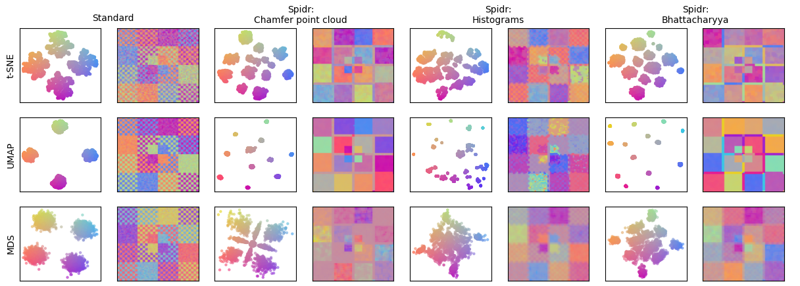

# Spatial Information in Dimensionality Reduction (Spidr) Plugin

The plugin wraps the Spidr implementation from [here](https://github.com/biovault/Spidr/), which builds on top of the A-tSNE implementation from the [HDILib](https://github.com/biovault/HDILib).



## Build
To clone the plugin repo and all its dependencies:

```git clone --recurse-submodule https://github.com/ManiVaultStudio/SpidrPlugin.git```

Build the project with the same generator as the ManiVault core, see instructions [here](https://github.com/ManiVaultStudio/core).

## References
This plugin implements methods presented in **Incorporating Texture Information into Dimensionality Reduction for High-Dimensional Images** (2022), published at [PacificVis 2022](https://doi.org/10.1109/PacificVis53943.2022.00010). A preprint is available on [arXiv](https://arxiv.org/abs/2202.09179), the conference talk recording and other supplemental material are available [here](http://graphics.tudelft.nl/Publications-new/2022/VVLEH22/).

```
@InProceedings { VVLEH22,
  author       = "Vieth, Alexander and Vilanova, Anna and Lelieveldt, Boudewijn P.F. and Eisemann, Elmar and H\öllt, Thomas",
  title        = "Incorporating Texture Information into Dimensionality Reduction for High-Dimensional Images",
  booktitle    = "2022 15th IEEE Pacific Visualization Symposium (PacificVis)",
  pages        = "11-20",
  year         = "2022",
  doi          = "10.1109/PacificVis53943.2022.00010",
  keywords     = "Mathematics of computing, Dimensionality reduction,  Human-centered computing, Visualization techniques, Human-centered computing, Visual analytics",
  url          = "http://graphics.tudelft.nl/Publications-new/2022/VVLEH22"
}
```
